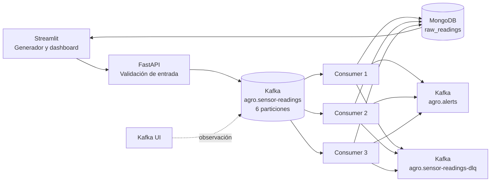

# Arquitectura de AgroStream IoT

## Flujo completo

## Responsabilidades

- Streamlit: interfaz de generación, filtros, gráficas y estado operativo.
- FastAPI: entrada HTTP, validación de solicitudes, publicación confirmada y consultas centralizadas.
- Kafka: buffer durable, desacoplamiento, particionado y replay.
- Consumidor: deserialización, validación de contrato, recalculado de anomalías, deduplicación, persistencia, alertas y DLQ.
- MongoDB: lecturas únicas, agregaciones, errores, ejecuciones y métricas.
- Kafka UI: inspección visual; no forma parte de la lógica de negocio.

## Kafka

`agro.sensor-readings` tiene seis particiones y usa `parcel_id` como clave. Kafka garantiza el orden dentro de una partición; las lecturas de una parcela terminan en la misma partición mientras la clave y la asignación se mantengan. No hay orden global entre parcelas.

La DLQ y alertas tienen tres particiones porque su volumen esperado es menor. Todos los topics locales tienen replication factor 1. La configuración HA separada usa tres brokers y replication factor 3, pero tres brokers en la misma laptop no eliminan el punto único de fallo del host.

El grupo `agro-sensor-processors` permite que una partición sea procesada por un solo miembro activo. El máximo de paralelismo útil del topic principal es seis consumidores; tres consumidores demuestran escala horizontal sin crear seis procesos.

## Semántica de entrega

El productor usa `acks=all`, idempotencia habilitada, reintentos, compresión, batching, callbacks y flush controlado. El consumidor desactiva auto-commit y confirma el offset solo después de completar persistencia y publicación requerida.

La semántica es at-least-once: una caída entre almacenamiento y commit puede causar redelivery. El índice único de `raw_readings.event_id` evita que una lectura se almacene dos veces. La publicación de alertas tiene el campo `alert_published` para hacer visible el estado y el riesgo entre efectos externos; este trade-off se documenta en `DECISIONES_TECNICAS.md`.

## MongoDB

Colecciones:

- `raw_readings`: lecturas válidas y únicas.
- `parcel_aggregates`: contadores por parcela y medición.
- `processing_errors`: fallos permanentes y trazabilidad DLQ.
- `ingestion_runs`: ejecuciones del productor.
- `consumer_metrics`: procesados, duplicados, inválidos y anomalías.

## Escalabilidad

El productor agrupa confirmaciones dentro de un lote. Kafka distribuye por particiones. Los consumidores se escalan con `docker compose up -d --scale consumer=3`. MongoDB usa índices para las consultas de parcela y tiempo; su capacidad puede convertirse en el cuello de botella antes que Kafka en una laptop.

## Disponibilidad

El desarrollo local usa un broker Kafka y MongoDB standalone autenticado. Esto permite reproducibilidad, no HA. `docker-compose.ha.yml` levanta tres brokers KRaft, RF=3 y `min.insync.replicas=2` cuando los recursos permitan la prueba. La caída de un broker solo es una prueba HA si se observa continuidad, ISR y confirmaciones reales.

## Recuperación

- Consumidor caído: el group rebalancea y los offsets no confirmados pueden redeliverarse.
- Mensaje inválido: se valida, se registra y se publica en DLQ antes de confirmar.
- Error transitorio: se reintenta de forma acotada sin clasificarlo automáticamente como inválido.
- Agregaciones: el consumidor actualiza contadores y `scripts/recompute_aggregates.py` puede reconstruirlos desde lecturas crudas sin reenviar Kafka.
